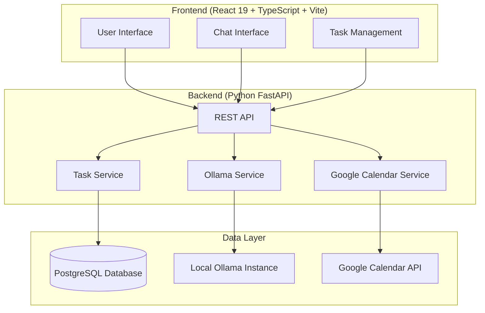

# Design Document

## Overview

The Ollama Todo App is a local-first application that combines modern web technologies with AI-powered task management. The system consists of a React 19 frontend with TypeScript and Vite, a Python FastAPI backend, PostgreSQL database for persistence, and integration with local Ollama models for intelligent task processing.

The architecture follows a clean separation of concerns with the frontend handling user interactions, the backend managing business logic and data persistence, and Ollama providing AI capabilities for task generation, categorization, and analysis.

## Architecture



## Components and Interfaces

### Frontend Components

#### Task Management Interface
- **TaskList Component**: Displays all tasks with filtering and sorting capabilities
- **TaskItem Component**: Individual task display with inline editing
- **TaskForm Component**: Create/edit task modal with form validation
- **TaskFilters Component**: Filter tasks by status, priority, category, and date

#### Chat Interface
- **ChatContainer Component**: Main chat interface for AI interactions
- **MessageList Component**: Display conversation history
- **PromptInput Component**: Input field for natural language prompts
- **TaskPreview Component**: Preview generated tasks before adding to list

#### Integration Components
- **CalendarSync Component**: Google Calendar integration settings and sync status
- **SettingsPanel Component**: Application configuration and preferences

### Backend Services

#### Task Service
```python
class TaskService:
    def create_task(self, task_data: TaskCreate) -> Task
    def get_tasks(self, filters: TaskFilters) -> List[Task]
    def update_task(self, task_id: int, updates: TaskUpdate) -> Task
    def delete_task(self, task_id: int) -> bool
    def mark_complete(self, task_id: int) -> Task
```

#### Ollama Service
```python
class OllamaService:
    def __init__(self):
        self.client = ollama.Client(host='http://localhost:11434')
    
    def generate_tasks_from_prompt(self, prompt: str) -> List[GeneratedTask]
    def categorize_task(self, task_description: str) -> TaskCategory
    def suggest_priority(self, task_description: str, due_date: datetime) -> Priority
    def analyze_workload(self, tasks: List[Task]) -> WorkloadAnalysis
    def improve_task_description(self, description: str) -> str
```

#### Calendar Service
```python
class CalendarService:
    def authenticate_google_calendar(self, credentials: dict) -> bool
    def sync_task_to_calendar(self, task: Task) -> CalendarEvent
    def update_calendar_event(self, task: Task, event_id: str) -> bool
    def remove_calendar_event(self, event_id: str) -> bool
```

## Data Models

### Task Model
```python
class Task(BaseModel):
    id: int
    title: str
    description: Optional[str]
    due_date: Optional[datetime]
    priority: Priority  # LOW, MEDIUM, HIGH, URGENT
    category: Optional[str]
    status: TaskStatus  # PENDING, IN_PROGRESS, COMPLETED
    created_at: datetime
    updated_at: datetime
    calendar_event_id: Optional[str]
    ai_generated: bool = False
```

### Chat Models
```python
class ChatMessage(BaseModel):
    id: int
    content: str
    role: MessageRole  # USER, ASSISTANT
    timestamp: datetime
    generated_tasks: Optional[List[GeneratedTask]]

class GeneratedTask(BaseModel):
    title: str
    description: str
    suggested_due_date: Optional[datetime]
    suggested_priority: Priority
    suggested_category: str
    confidence_score: float
```

### Database Schema
```sql
-- Tasks table
CREATE TABLE tasks (
    id SERIAL PRIMARY KEY,
    title VARCHAR(255) NOT NULL,
    description TEXT,
    due_date TIMESTAMP,
    priority VARCHAR(20) DEFAULT 'MEDIUM',
    category VARCHAR(100),
    status VARCHAR(20) DEFAULT 'PENDING',
    created_at TIMESTAMP DEFAULT CURRENT_TIMESTAMP,
    updated_at TIMESTAMP DEFAULT CURRENT_TIMESTAMP,
    calendar_event_id VARCHAR(255),
    ai_generated BOOLEAN DEFAULT FALSE
);

-- Chat messages table
CREATE TABLE chat_messages (
    id SERIAL PRIMARY KEY,
    content TEXT NOT NULL,
    role VARCHAR(20) NOT NULL,
    timestamp TIMESTAMP DEFAULT CURRENT_TIMESTAMP,
    generated_tasks JSONB
);
```

## Ollama Integration Details

### Connection Setup
The backend will use the `ollama-python` library to connect to a local Ollama instance:

```python
import ollama

class OllamaService:
    def __init__(self, host: str = "http://localhost:11434"):
        self.client = ollama.Client(host=host)
        self.model = "llama2"  # Default model, configurable
    
    def check_connection(self) -> bool:
        try:
            models = self.client.list()
            return len(models['models']) > 0
        except Exception:
            return False
```

### Prompt Engineering
Structured prompts for different AI tasks:

```python
TASK_GENERATION_PROMPT = """
You are a helpful task management assistant. Convert the following user request into a structured list of actionable tasks.

User request: {user_prompt}

Please respond with a JSON array of tasks, each containing:
- title: A clear, actionable task title
- description: Detailed description of what needs to be done
- suggested_due_date: ISO format date when this should be completed (if applicable)
- suggested_priority: LOW, MEDIUM, HIGH, or URGENT
- suggested_category: A relevant category for this task

Response format: JSON array only, no additional text.
"""

TASK_CATEGORIZATION_PROMPT = """
Categorize the following task into one of these categories: Work, Personal, Health, Finance, Learning, Shopping, or Other.

Task: {task_description}

Respond with only the category name.
"""
```

## Error Handling

### Ollama Connection Errors
- Graceful degradation when Ollama is unavailable
- Retry logic with exponential backoff
- Clear user feedback about AI feature availability
- Fallback to manual task creation when AI features fail

### Database Errors
- Connection pooling and retry mechanisms
- Transaction rollback on failures
- Data validation before database operations
- Backup and recovery procedures

### API Error Responses
```python
class ErrorResponse(BaseModel):
    error: str
    message: str
    details: Optional[dict] = None

# Standard HTTP error codes
# 400: Bad Request (validation errors)
# 404: Not Found (task not found)
# 500: Internal Server Error (database/ollama errors)
# 503: Service Unavailable (ollama offline)
```

## Testing Strategy

### Frontend Testing
- **Unit Tests**: Component testing with React Testing Library
- **Integration Tests**: API integration and user workflows
- **E2E Tests**: Complete user journeys with Playwright
- **Accessibility Tests**: WCAG compliance testing

### Backend Testing
- **Unit Tests**: Service layer and utility functions with pytest
- **Integration Tests**: Database operations and Ollama integration
- **API Tests**: FastAPI endpoint testing with test client
- **Mock Tests**: Ollama service mocking for CI/CD

### Test Data Management
- Fixtures for consistent test data
- Database seeding for development and testing
- Mock Ollama responses for reliable testing
- Separate test database configuration

### Performance Testing
- Load testing for concurrent users
- Database query optimization
- Ollama response time monitoring
- Frontend bundle size optimization